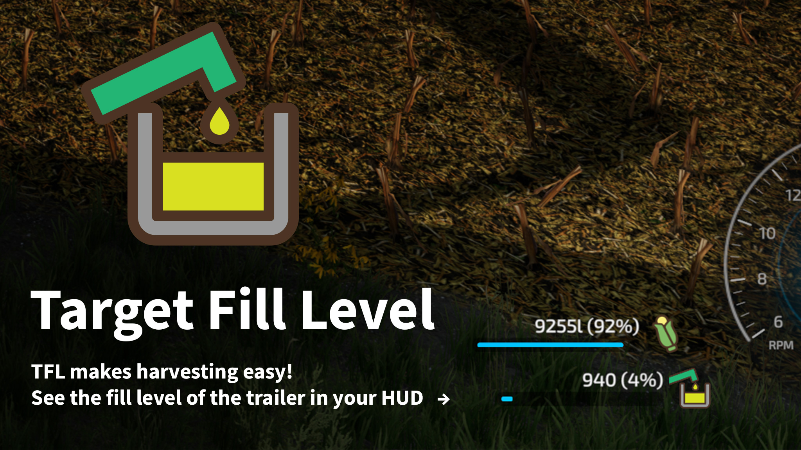

# Target Fill Level

This is a Mod for Farming Simulator 22.

**[Download latest development version here](https://github.com/VertexDezign/TargetFillLevel/releases/download/latest/FS22_TargetFillLevel.zip)**

You want to know how full the trailer you're loading is? Combine and forage harvester drivers love this mod. The fill level of the targeted trailer is now shown in the HUD.

Please report bug on [Github](https://github.com/VertexDezign/TargetFillLevel/issues).

[FS22_TargetFillLevel](https://github.com/VertexDezign/TargetFillLevel/) by [André Buchmann](https://github.com/schliesser/) & [VertexDezign](https://vertexdezign.net/) is licensed under [CC BY NC ND 4.0](http://creativecommons.org/licenses/by-nc-nd/4.0/)
